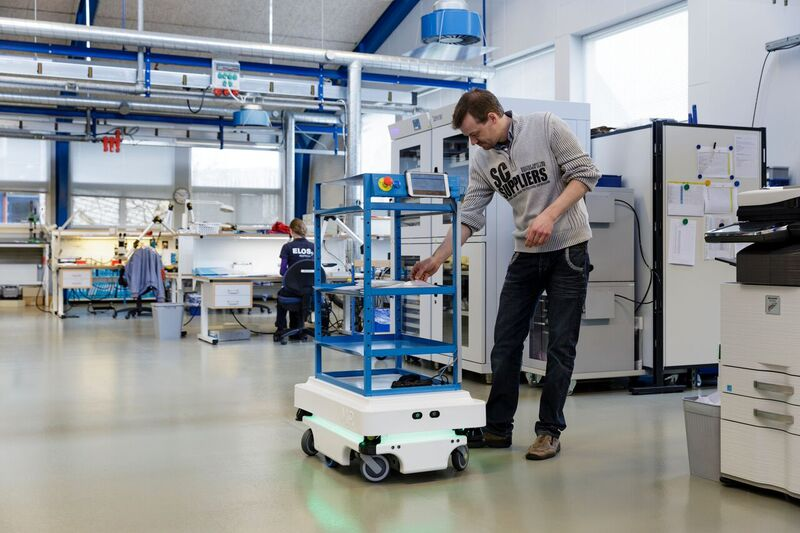

---
---

# Applications

Our project can be used in a variety of robotics fields. One example could be robots performing autonomous delivery of packages or tools in a factory given a map of the factory. Since the factory has many known obstacles, getting a map of the factory can help the robot autonomously drive throughout the factory. This can happen both in simulation and real life.  

[Source](https://automatewarehousing.com/news/senior-techncial-appointment-at-automate-2-2-2-2-3)
