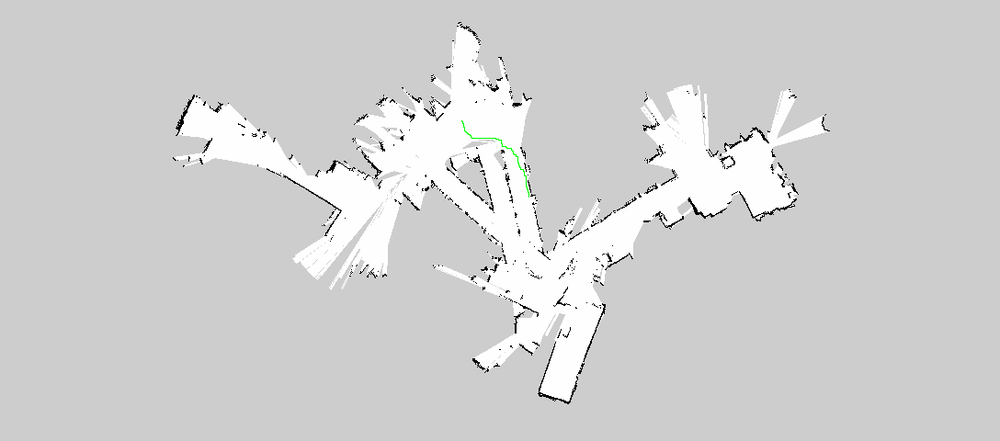

---
---

# Demonstration
We start out by getting the following map from Lidar data from the TurtleBot.

Then we select two points in the map that we want the robot to traverse, and our program draws a path on the map.

Then our program will send this path to another script that has a simulated robot traverse the path in real time.

-- To Do --
