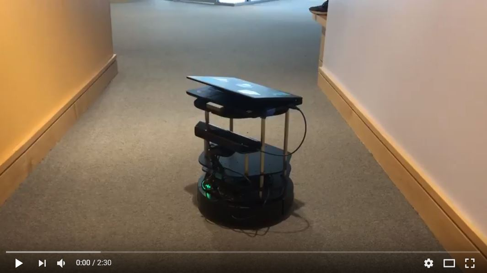

---
---

# Demonstration
We start out by getting the following map from Lidar data from the TurtleBot.

Then we select two points in the map that we want the robot to traverse, and our program draws a path on the map using the A* algorithm.

Then we publish the velocities to ROS, and the robot moves in real life.

Demonstration of paths explored using the A* algorithm:

Video of the robot traveling along a path:

