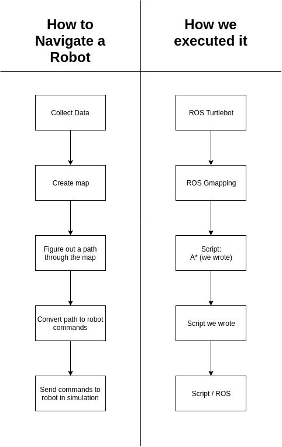

# Intro
We made a program that allows a robot to navigate a known map effectively. We got a map of the third floor of the Campus Center at Olin College by running a Turtlebot through the floor and receiving LIDAR data from a Kinect. From there we selected a goal for the simulated robot to go to and our program calculated the best path for the robot to take. Then we gave the robot instructions on how to navigate the map to get to the goal.

Our launch file encompasses the following all into one easy step.

## For more information about environment setup, algorithms, and how to use our code, please see our Wiki!
[Link to our Wiki](https://github.com/AmyPhung/SLAM-SoftDes-Final-Project/wiki)

[Source Code](https://github.com/AmyPhung/SLAM-SoftDes-Final-Project)
