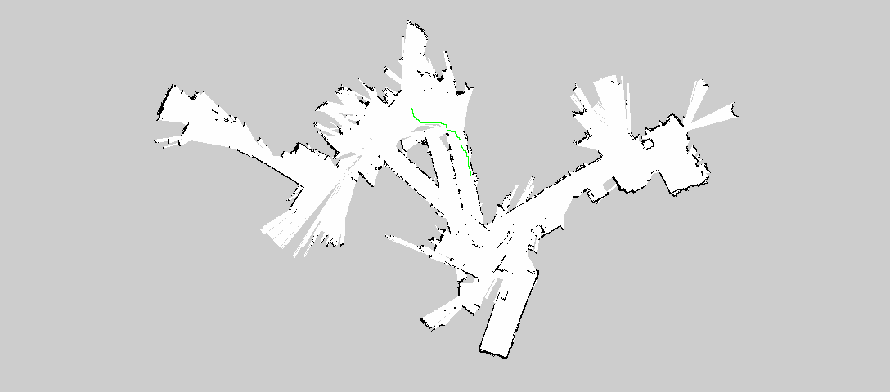

# Intro
We made a program that allows a robot to navigate a known map effectively. We got a map of the third floor of the Campus Center at Olin College by running a Turtlebot through the floor and receiving LIDAR data from a Kinect. From there we selected a goal for the simulated robot to go to and our program calculated the best path for the robot to take. Then we gave the robot instructions on how to navigate the map to get to the goal.

[INSERT DEMONSTRATION VIDEO HERE]

# Demonstration
We start out by getting the following map from Lidar data from the TurtleBot.

Then we select two points in the map that we want the robot to traverse, and our program draws a path on the map.

Then our program will send this path to another script that has a simulated robot traverse the path in real time.

-- To Do --
Add video of robot navigating area

## For more technical information about environment setup, algorithms, and how to use our code, please see our Wiki!
[Link to our Wiki](https://github.com/AmyPhung/SLAM-SoftDes-Final-Project/wiki)

[Source Code](https://github.com/AmyPhung/SLAM-SoftDes-Final-Project)
