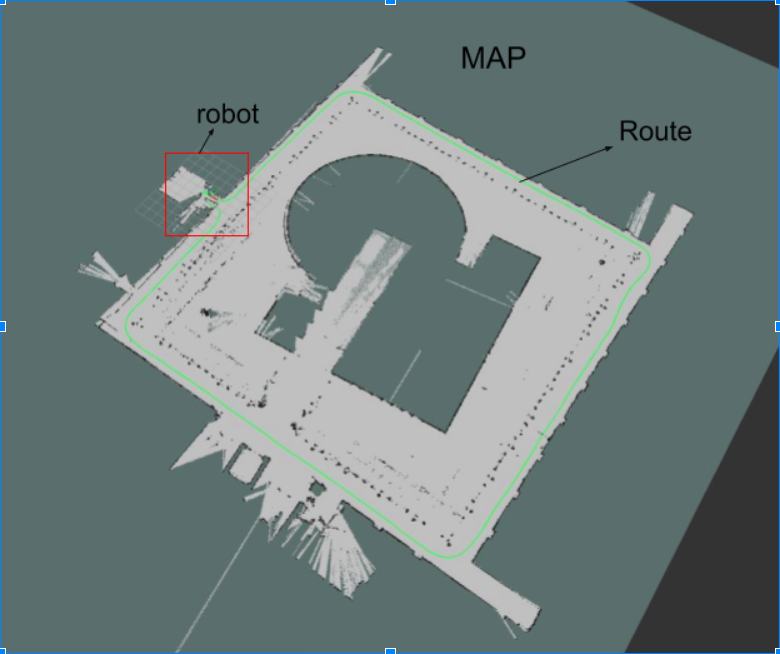
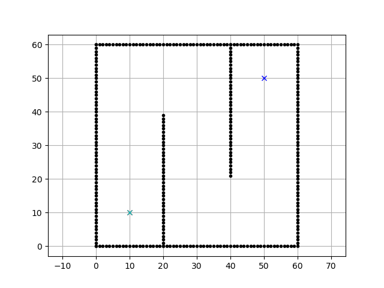
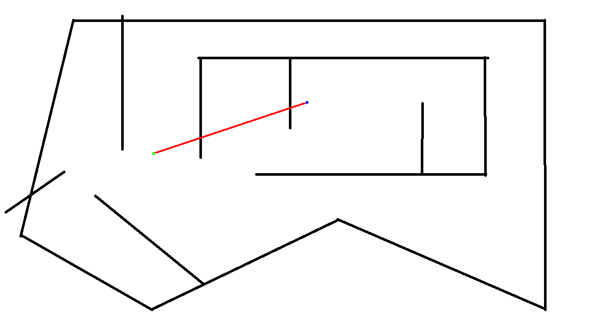

# Architectural Review for Final Project
## By Amy Phung, Nathan Estill, Sherrie Shen
### Main Goal: 
See if there are more efficient and/or easier algorithms to try for maze navigation and to collect opinions on different applications our final product could be used for.

## Background and context 
### Overall Project Goal: 
Use Hector Slam ROS package to make a map from collected lidar data then write a script that uses an algorithm to trace out the shortest correct route on the map and send commands to a simulated robot  

### A star algorithm:

The A star algorithm gives the surrounding spaces that are open a number F. F is calculated by taking the cost that it takes the robot to get to that space (usually distance) from the start plus the cost that it estimates it will take to get the the destination (assuming there are no obstacles. Then after reaching the end point, it follows the path of the least F back to the origin.

## Key questions
+ Are there other algorithms for path planning that people are aware of that are more efficient and/or simpler to implement 
+ What are some interesting applications we could apply our project to? We were thinking mostly about robotics and maze navigation, but more input on possible applications would be welcome
## Agenda for technical review session 
We will use prepared google slides to supplement our explanations during the technical review session
+ Indicate goal
+ Provide background info and explain approach
+ (Ask if they’re confused if time)
+ Ask key questions
## Feedback form
Link: [https://docs.google.com/forms/d/e/1FAIpQLSdyqwWstD6feafA-pWRNSS6sEvqPqu2zfOOQF-g1FBGpn-xZA/viewform?usp=sf_link](https://docs.google.com/forms/d/e/1FAIpQLSdyqwWstD6feafA-pWRNSS6sEvqPqu2zfOOQF-g1FBGpn-xZA/viewform?usp=sf_link)
## Google slides
Link: [https://docs.google.com/presentation/d/1SBtdeILvHlUUfGx--yX7Hf_4wvaVNvVHifvy5clsGqA/edit?usp=sharing](https://docs.google.com/presentation/d/1SBtdeILvHlUUfGx--yX7Hf_4wvaVNvVHifvy5clsGqA/edit?usp=sharing)
