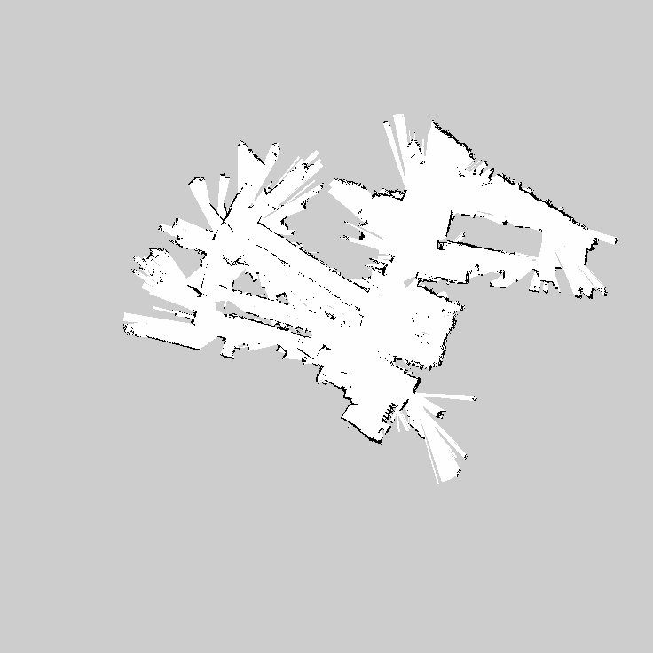
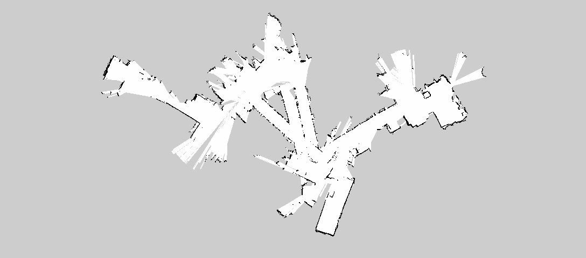
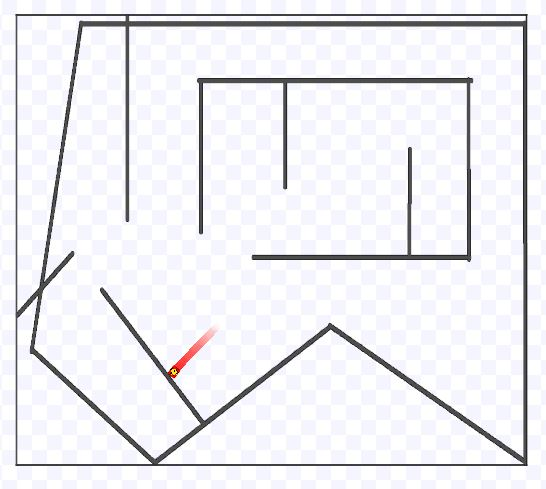
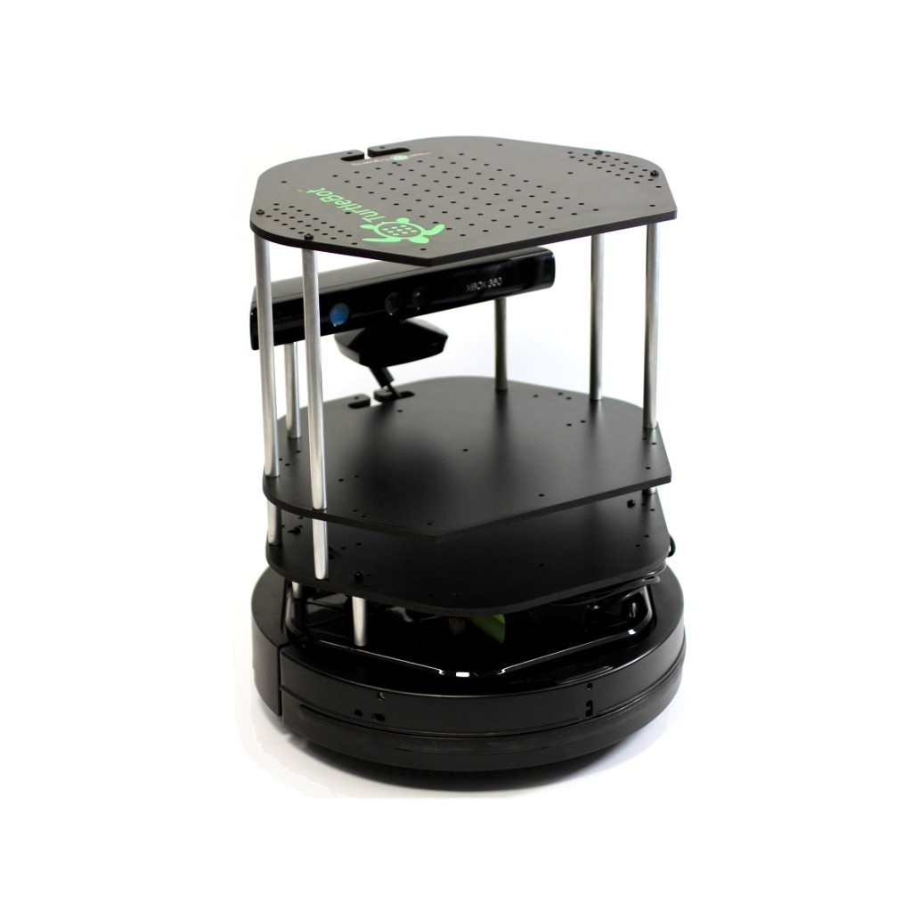

# Architectural Review for Final Project
## By Amy Phung, Nathan Estill, Sherrie Shen
### Main Goal:
See if there are more efficient and/or easier algorithms to try for maze navigation and to collect opinions on different applications our final product could be used for.

## Current Progress:
Use Gmapping, a ROS package, to make a map from collected lidar data with a Turtlebot then write a script that uses an algorithm to trace out the shortest correct route on the map and send commands to a simulated robot.

### Map Data
The Ros Gmapping package allows us to do SLAM on collected lidar data and create a map by driving the Turtlebot around an area. The gray regions are unexplored area and black lines or dots are boundaries or obstacles. We found the package worked the best when collecting data in a confined region and the two pictures show below are two maps we collected in the lower level of Olin library. The next step would be to c

Map 1:

Map2:

### A star algorithm:
The algorithm takes two points, a start and a finish, and returns a list of coordinates the robot has to go to to get to the finish. It is very slow now, taking over 10 seconds to get the path. This is due to the large size of the grid, making it go through many points to get to the goal. The algorithm also takes into account the size of the robot to make sure that the edges of the robot doesn't hit any obstacles.

### Ros Commands Navigation
Based on the path found using the A star algorithm, velocity and heading commands
are computed and published to ROS velocity and heading topics to control the
simulation. When we are confident our code works and have thoroughly tested it
in simulation, we will move forward with testing it with the Turtlebot.

## Key questions
+ What places would be interesting to take data from to get our map?
+ What are some good ways to speed up the path finding algorithm?

## Agenda for technical review session
We will use prepared google slides to supplement our explanations during the technical review session
+ Indicate goal
+ Provide background info and explain approach
+ (Ask if they’re confused if time)
+ Ask key questions
## Feedback form
Link: [https://docs.google.com/forms/d/e/1FAIpQLSdDumK3AAqetfKsMcBa6oK0_KcIQg-S_ZD1vhA9R23RfPmrMg/viewform?usp=sf_link](https://docs.google.com/forms/d/e/1FAIpQLSdDumK3AAqetfKsMcBa6oK0_KcIQg-S_ZD1vhA9R23RfPmrMg/viewform?usp=sf_link)
## Google slides
Link: [https://docs.google.com/presentation/d/12iJVFavqD7ng49UynAnbefedbR3epc5thkh5A0iFOtM/edit#slide=id.g3854c3a3c6_0_0](https://docs.google.com/presentation/d/12iJVFavqD7ng49UynAnbefedbR3epc5thkh5A0iFOtM/edit#slide=id.g3854c3a3c6_0_0)
